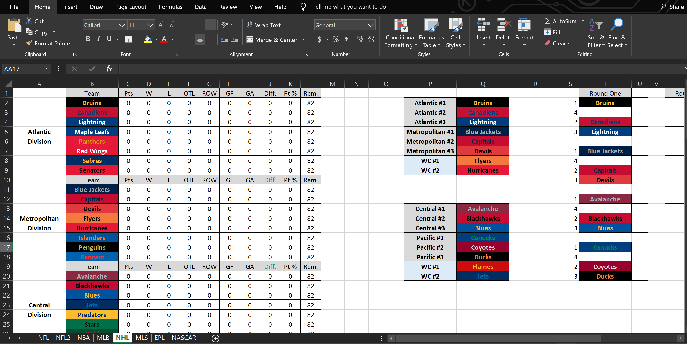

# Comprehensive Sports Data Web Application

Originally this project was confined in separate Microsoft Excel documents utilizing multiple formulas and conditional formatting to customize cells with official team colors. Eventually the size and complexion of the files caused slow runtimes and even crashes.

Eventually my development skills evolved and I began to undertake a project to migrate the information to a Web interface, with more stable data storage and more user-friendly presentation.

