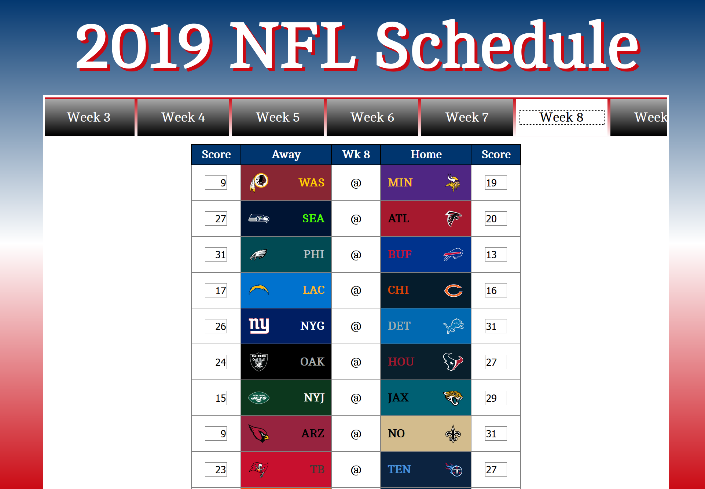
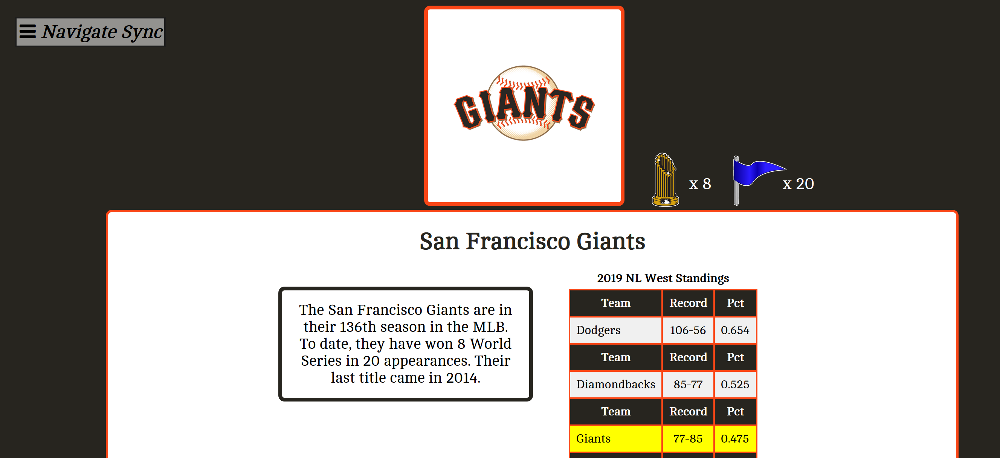
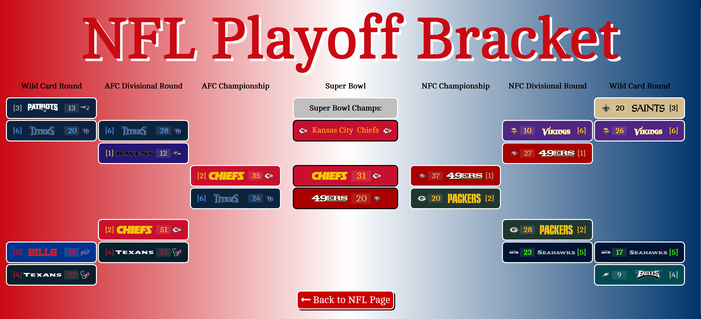

# Comprehensive Sports Data Web Application

### Inspiration
Originally this project was confined in separate Microsoft Excel documents utilizing multiple formulas and conditional formatting to customize cells with official team colors. Eventually the size and complexion of the files caused slow runtimes and even crashes.

Over time my development skills evolved and I began to undertake a project to migrate the information to a Web interface, with more stable data storage and more user-friendly presentation.

### Login
I use two-factor authentification through the DuoMobile service for logging into my Web application. This ensures that only I can access the application, and the request dies after 60 seconds without a response.

### Schedules
Leagues that follow a weekly schedule (National Football League, Major League Soccer, English Football League) have a schedule page in their directories. Schedules are imported via a .CSV file into the schedule database with required headers. From there a php function creates each weekly schedule as appropriate.

The schedule pages themselves process the results, updating scores and win-loss records in the database.

### Team Bios
There is a page for each individual team accounted for in the database. Accessing these team pages can be done by clicking on a team's logo in a records page or by going to the Teams page in the appropriate directory.

Clicking on a team's page provides a small bio providing championship history, a graphic displaying the number of title's to a team's name, and a glimpse at the current season's standings and/or schedule. The page is styled in each team's official colors.

### Playoffs
Each league with a playoff system has a dedicated Playoff page. On this page is a playoff tree as well as an option to update the playoffs (the only exception is the NFL page - updates to the playoffs are done in the Schedule page). Each leaf in the tree provides team name, logo, and score/games won.

