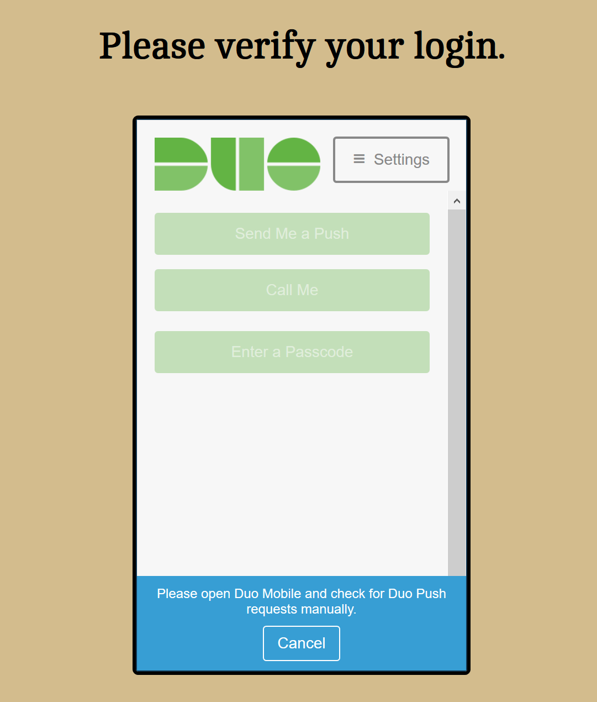

# Comprehensive Sports Data Web Application

Note: Assets and database used for this project not included in this repository.

### Inspiration
Originally this project was confined in separate Microsoft Excel documents utilizing multiple formulas and conditional formatting to customize cells with official team colors. Eventually the size and complexion of the files caused slow runtimes and even crashes.

Over time my development skills evolved and I began to undertake a project to migrate the information to a Web interface, with more stable data storage and more user-friendly presentation.

### Login
I use two-factor authentification through the DuoMobile service for logging into my Web application. This ensures that only I can access the application, and the request dies after 60 seconds without a response.

### Schedules
Leagues that follow a weekly schedule (National Football League, Major League Soccer, English Football League) have a schedule page in their directories. Schedules are imported via a .CSV file into the schedule database with required headers. From there a php function creates each weekly schedule as appropriate.

The schedule pages themselves process the results, updating scores and win-loss records in the database.

### Team Bios
There is a page for each individual team accounted for in the database. Accessing these team pages can be done by clicking on a team's logo in a records page or by going to the Teams page in the appropriate directory.

Clicking on a team's page provides a small bio providing championship history, a graphic displaying the number of title's to a team's name, and a glimpse at the current season's standings and/or schedule. The page is styled in each team's official colors.

### Playoffs
Each league with a playoff system has a dedicated Playoff page. On this page is a playoff tree as well as an option to update the playoffs (the only exception is the NFL page - updates to the playoffs are done in the Schedule page). Each leaf in the tree provides team name, logo, and score/games won.

### Evolution Of Ideas

As a kid, I always created sports universes where leagues and teams were 100% my creation, developments and storylines included. I was always limited to pens and paper for creation, and no real way to let the leagues authentically develop without my biases. Nowadays, there exist means for this kind of hands-on customization and hands-off simulation to exist, where I can watch the teams I imagined develop in their own virtual universe and I can track them.

For example, Out Of The Park Baseball provides easily customizable baseball universes, perfect for the baseball league I grew up imagining. Fortunately, they also provide an extensive amount of data for exporting and tracking. I used this data at the conclusion of every simulated month to catalog standings, stats leaders, and award winners. When this information is exported, I use a python script to import said data into my database, where I can present it in an easy-to-read format in my Web application.

### Preserving Virtual History

While my Web application is fairly comprehensive in cataloging current and historical data for these fictional leagues/series, I wanted to further my understanding and skills in Python. One of these methods is by posting the data with more context in Reddit posts to a subreddit where I can present the information in a chronological manner that makes it easy to see the universe develop.

Another fictional series I have is a stock car simulation series, again fully-customized and hands-off using NASCAR Racing 2003, abandonware that has been modded and preserved by its user base. NR2003 also has a function for exporting race data. One python script reads the HTML data exported and imports it into my database for my Web application.

A second Python script pulls the information from the database and spits it out in a readable manner, complete with captions for context to the results and what they mean in the big picture for the season. A script and subreddit exists for each virtual league/series of mine. 

As a result, I have two locations where I can preserve and revisit developments of teams and series that began in my imagination as a kid.